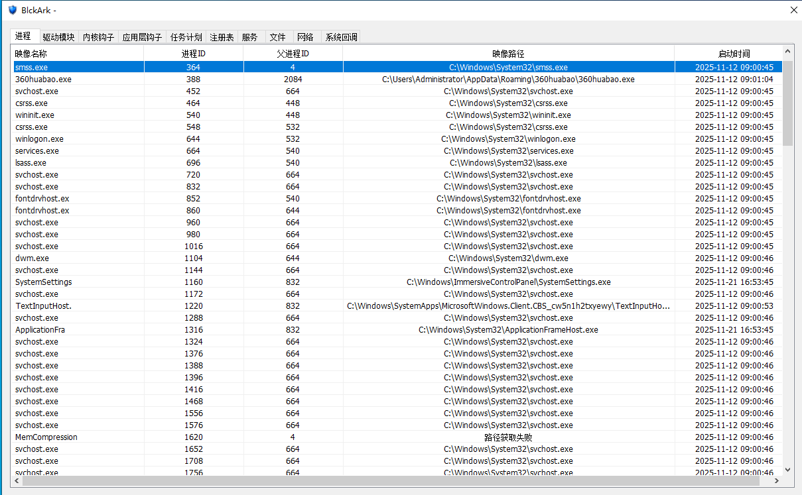
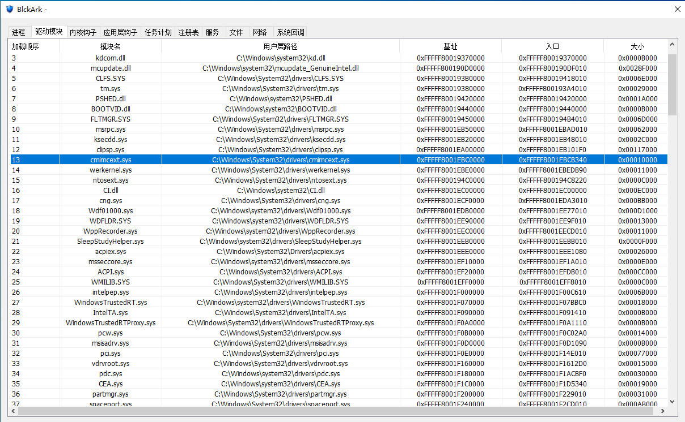
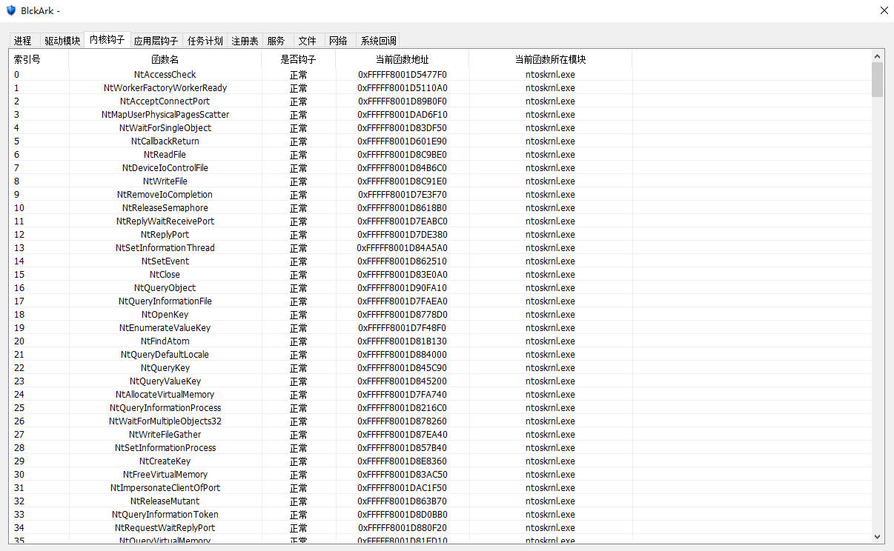
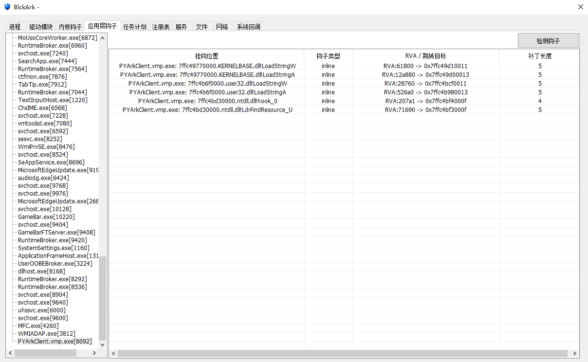

# BlckArk

## 项目简介 | Project Introduction

**BlckArk** 是一款面向 Windows 平台的系统安全分析与异常排查工具，集成了用户层与内核层的多项系统检测能力。软件可用于查看进程、驱动模块、系统钩子、计划任务、注册表、服务、文件、网络连接以及系统回调等关键安全信息。

**BlckArk** is a Windows-based system security analysis and anomaly inspection tool that integrates multiple user-mode and kernel-mode inspection capabilities. It can be used to examine critical security-related information, including processes, driver modules, system hooks, scheduled tasks, registry entries, services, files, network connections, and system callbacks.

BlckArk 通过统一的图形化界面展示系统运行状态，帮助用户快速发现可疑进程、异常驱动、恶意持久化项、Hook 劫持行为以及内核级监控活动，适用于系统安全巡检、恶意软件分析、Rootkit 排查和安全研究等场景。

Through a unified graphical interface, BlckArk presents system runtime information and helps users identify suspicious processes, abnormal drivers, malicious persistence entries, hook hijacking behaviors, and kernel-level monitoring activities. It is suitable for system security inspection, malware analysis, Rootkit investigation, and security research.

> 本工具涉及系统底层信息读取与部分管理操作，建议在管理员权限下运行，并在合法、受控的环境中使用。  
> This tool involves low-level system inspection and certain management operations. It is recommended to run it with administrator privileges and use it only in authorized and controlled environments.

---

## 功能概览 | Feature Overview

BlckArk 当前包含以下核心功能模块：  
BlckArk currently includes the following core functional modules:

| 功能模块 | Feature Module | 说明 / Description |
| --- | --- | --- |
| 进程 | Process | 查看并分析系统运行中的进程信息 / View and analyze running processes |
| 驱动模块 | Driver Modules | 枚举系统已加载的内核驱动 / Enumerate loaded kernel drivers |
| 内核钩子检查 | Kernel Hook Inspection | 检测关键内核调用路径是否异常 / Detect abnormal kernel-level hook behaviors |
| 应用层钩子检查 | User-Mode Hook Inspection | 检查用户态 API 是否被劫持 / Inspect possible user-mode API hooking |
| 任务计划 | Scheduled Tasks | 分析计划任务持久化行为 / Analyze scheduled task persistence |
| 注册表 | Registry | 浏览和分析注册表关键项 / Browse and inspect important registry entries |
| 服务 | Services | 查看系统服务及运行状态 / Inspect system services and states |
| 文件 | Files | 浏览文件并定位可疑实体 / Browse files and locate suspicious objects |
| 网络 | Network | 查看系统网络连接行为 / Inspect system network connections |
| 系统回调 | System Callbacks | 分析内核回调注册情况 / Analyze registered kernel callbacks |

---

## 适用场景 | Applicable Scenarios

BlckArk 可应用于以下场景：  
BlckArk can be applied in the following scenarios:

- Windows 系统安全巡检  
  Windows system security inspection.

- 恶意软件行为分析  
  Malware behavior analysis.

- Rootkit 与内核异常排查  
  Rootkit and kernel anomaly investigation.

- 启动项与持久化行为检查  
  Startup entry and persistence behavior inspection.

- 可疑网络通信分析  
  Suspicious network communication analysis.

- 驱动、服务与系统回调研究  
  Driver, service, and system callback research.

- 系统故障与异常程序定位  
  System fault diagnosis and abnormal program location.

---

## 注意事项 | Notes

- 遵守当地法律法规，请勿使用该公益软件进从事违法行为，后果自负。
  Please abide by laws and regulations. Do not use this public service software to engage in illegal activities. You will be responsible for the consequences of your actions.

- 该软件是作者闲暇时刻开发，投入的时间和精力有限，所以可能存在未知性的蓝屏BUG，请悉知。
  This software was developed in the author's spare time, with very little time and effort invested, so there may be unknown blue screen bugs. Please be aware of this.

## 运行环境 | Operating environment

- Windows 10 x64  

- MD5:
  BlckArk: 98C6466763A72C10D3F0F3FF63544A4E
  pe64.dll: 66B0057039519F20332B67F400892436

## 软件截图 | Software screenshots

